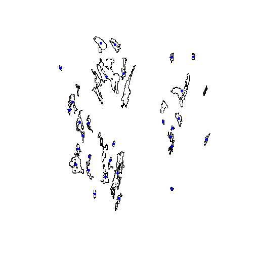

spsurveyMaine: select 30 Kennebec county lakes > 150 acres with an unstratified equal probability design
========================================================
# Initial Setup

load the packages needed for the analysis.


# Introduction

Sample design document for Kennebec county lakes > 150 acres.  Linda Bacon provided a shapefile with the lakes and asked for an unstratified equal probability design that includes 30 lakes.  We follow the 1st example in [Finite_Design.pdf](http://cran.r-project.org/web/packages/spsurvey/vignettes/Finite_Design.pdf) by Thomas Kincaid to use the R package spsurvey to conduct a GRTS survey designs for a finite resource. All data and code for this project are available on [github](https://github.com/willbmisled/spsurveyME).

# Data

The sample frame was provided by Linda Bacon as a shapefile with 39 lakes greater than 150 acres in Kennebec County.  The shapefile is in NAD_1983_UTM_Zone_19N.  The first step is reproject to albers equal area. Then the spatialPolygonsDataFrame must be converted to a spatialPointsDataFrame.


# spsurvey GRTS unstratified, equal probability design 

The finite resource used in the designs is lakes>150acres in Kennebec county Maine.  We use the R package "spsurvey" to develop unstratified, equal probability design for up to 30 lakes. The set.seed function is called so that, if necessary, the designs can be replicated.


```r
  # Read the attribute table from the shapefile
    att <- read.dbf("lakesAlb") 
  # Call the set.seed function so that the survey designs can be replicate
    set.seed(108)
  # Create the design list
    Equaldsgn <- list(None=list(panel=c(PanelOne=30), seltype="Equal")) #PanelOne=30 is the sample size
  # Select the sample
    Equalsites <- grts(design=Equaldsgn, #design file specified above
                   src.frame="sp.object",#source of the sample frame-in this case an the sp object "lakesAlb"
                   sp.object=lakesAlbPts,  #input sp object
                   shapefile=TRUE)      #whether to output the results as a shapefile
```

```
## 
## Stratum: None 
## Initial number of levels: 3 
## Current number of levels: 3 
## Current number of levels: 4 
## Current number of levels: 5 
## Final number of levels: 5
```


# Results

Below is a list of the selected sites.  The siteIDs are assigned by SPsurvey.  The idea is that you select the sites in order of the siteIDs.  If a site cannot be visited for any reason choose the next site from the list.  There is also a rough figure showing all of the lakes as polygons and the selected lakes as the blue centroids.

```r

# Print the initial six lines of the survey design
Equalsites@data[, c("siteID", "GNIS_ID", "GNIS_Name", "AreaSqKm", "ReachCode", 
    "acres")]
```

```
##     siteID  GNIS_ID            GNIS_Name AreaSqKm      ReachCode   acres
## 1  Site-01 00564618         Crowell Pond   0.8130 01030003002500   200.7
## 2  Site-02 00570303            Long Pond   2.0400 01050003001146   503.6
## 3  Site-03 00564126 Cobbosseecontee Lake  22.4364 01030003002614  5540.5
## 4  Site-04 00570551     Lower Togus Pond   2.0870 01030003002601   515.3
## 5  Site-05 00573060          Pattee Pond   2.1180 01030003002483   522.9
## 6  Site-06 00577064       Threemile Pond   4.7550 01030003002552  1174.2
## 7  Site-07 00581480        Pocasset Lake   2.4419 01040002008413   603.0
## 8  Site-08 00577060   Threecornered Pond   0.7340 01030003002575   181.3
## 9  Site-09 00567171           Great Pond  44.9090 01030003002515 11089.6
## 10 Site-10 00578662        Woodbury Pond   2.0777 01030003002634   513.1
## 11 Site-11 00570445         Lovejoy Pond   1.5370 01040002000947   379.4
## 12 Site-12 00577636   Upper Narrows Pond   0.9680 01030003002610   239.0
## 13 Site-13 00565669            East Pond   6.9530 01030003002478  1716.9
## 14 Site-14 00565081          Dexter Pond   2.8634 01030003002607   707.1
## 15 Site-15 00572994          Parker Pond   6.1710 01040002001112  1524.0
## 16 Site-16 00577212          Torsey Lake   2.7500 01030003002560   679.1
## 17 Site-17 00565857           Ellis Pond   2.8120 01030003002497   694.4
## 18 Site-18 00561261    Androscoggin Lake  16.2872 01040002001114  4022.2
## 19 Site-19 00572394           North Pond   9.0670 01030003002469  2239.0
## 20 Site-20 00565769            Echo Lake   4.9990 01040002001113  1234.4
## 21 Site-21 00570443         Lovejoy Pond   1.5360 01030003002479   379.3
## 22 Site-22 00564788           David Pond   1.2210 01040002000928   301.5
## 23 Site-23 00563951           China Lake  15.9520 01030003002521  3938.9
## 24 Site-24 00577161           Togus Pond   2.7310 01030003002590   674.4
## 25 Site-25 00572090       Nehumkeag Pond   0.7260 01030003002626   179.4
## 26 Site-26 00562092           Berry Pond   0.7076 01030003030629   174.7
## 27 Site-27 00561266   Annabessacook Lake   5.7300 01030003002622  1415.0
## 28 Site-28 00563569        Carleton Pond   0.9030 01030003002599   222.9
## 29 Site-29 00564139     Cochnewagon Lake   1.5960 01030003002628   394.2
## 30 Site-30 00576012       Spectacle Pond   0.6060 01030003002571   149.6
```

```r
# create 'map' of results
lakesSelect <- readShapePoints("sample.shp", proj4string = Albers)  #read the shapefile of selected lake (points)
plot(lakesAlb)
plot(lakesSelect, add = T, pch = 19, col = "blue")
```

 


